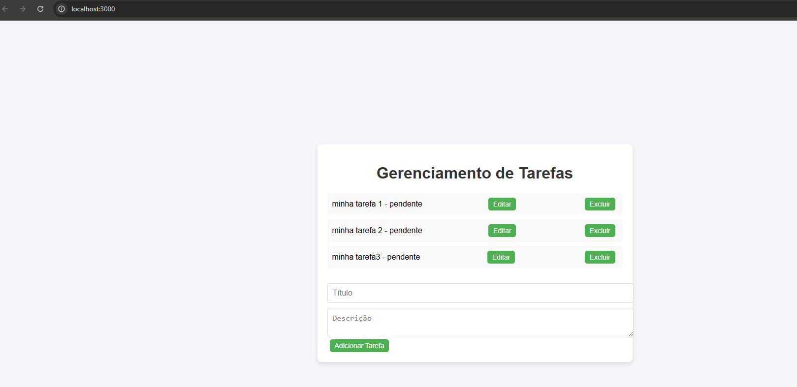

# Projeto gerenciamento de tarefas

Este é um projeto de gerenciamento de tarefas desenvolvido com React para a interface frontend e uma API backend utilizando um servidor local. Ele permite que os usuários criem, editem, excluam e visualizem tarefas.

## Tecnologias Utilizadas

- **Frontend**: React
- **Backend**: API RESTful com Node.js (Express)
- **Banco de Dados**: (Inserir banco de dados usado, se houver)

## Funcionalidades

- **Adicionar Tarefa**: Crie novas tarefas com título, descrição e status.
- **Editar Tarefa**: Modifique os detalhes de uma tarefa existente.
- **Excluir Tarefa**: Remova tarefas da lista.
- **Listar Tarefas**: Veja todas as tarefas cadastradas.

## Instalação e Execução

### Requisitos

- **Node.js**
- **npm** 

### Passos para executar o projeto

1. Clone o repositório:
   ```bash
   git clone https://github.com/alancastrom5/Gerenciamento-Tarefas.git
   cd Gerenciamento-Tarefas
    ```

2. Instale as dependências do frontend
   ```bash
    cd frontend
    npm install
    ```
3. Instale as dependências do backend
   ```bash
    cd backend
    npm install
    ```
4. Instale as dependências do Gerenciamento-tarefas
   ```bash
    cd Gerenciamento-tarefas
    npm install
    ```
## Execultando o Projeto:
execultando esse comando automaticamente inicia o front e o backend
   ```bash
    cd Gerenciamento-tarefas
    npm run start
```

Agora, acesse o http://localhost:3000 no seu navegador para visualizar a aplicação.


### Funcionalidades da API

A API do backend está disponível na URL http://localhost:3001/tasks. Abaixo estão os principais endpoints:

### GET /tasks

Retorna a lista de todas as tarefas.

Exemplo de resposta:

```javascript
[
  {
    "id": 1,
    "title": "Tarefa Exemplo",
    "description": "Descrição da tarefa",
    "status": "pendente"
  }
]
```

### POST /tasks

 Cria uma nova tarefa.

Exemplo de resposta:

```javascript
[
  {
    "id": 1,
    "title": "Tarefa Exemplo",
    "description": "Descrição da tarefa",
    "status": "pendente"
  }
]
```

### PUT /tasks/{id}

 Cria uma nova tarefa.

Exemplo de resposta:

```javascript
[
  {
    "id": 1,
    "title": "Tarefa Exemplo",
    "description": "Descrição da tarefa",
    "status": "pendente"
  }
]
```

### DELETE /tasks/{id}
Exclui uma tarefa existente.


## Front-end



Bem simples de usar, como podemos ver na foto acima.


## Decisões Técnicas

Durante o desenvolvimento do projeto, algumas decisões técnicas foram tomadas para garantir simplicidade, escalabilidade e desempenho do aplicativo:

1. **Uso React.js como front-end**: Escolhemos usar React para construir a interface porque ele tem recursos de modificação e gerenciamento de estado para ajudar na reação do desenvolvimento da interface.

2. **Backend com Node.js e Express***: Node.js com Express foi escolhido como backend devido ao seu desempenho e integração com sistemas baseados em JavaScript. Escolha Express para rotear e gerenciar facilmente solicitações HTTP.

3. **Axios para solicitações HTTP**: A biblioteca Axios foi escolhida para lidar com solicitações HTTP devido à sua simplicidade e suporte a promessas, o que facilita o processamento assíncrono.

4. **Usando State no React** : `useState` é usado para armazenar e gerenciar funções e gerenciar o estado com antecedência, tornando o gerenciamento de estado no aplicativo simples e eficiente.

5. **Uso do `useEffect`**: o React usa `useEffect` para colocar a tarefa em segundo plano no momento do carregamento da classe (quando o aplicativo é iniciado), garantindo que a lista de tarefas seja aplicada assim que o aplicativo for aberto. Isso torna a integração de dados e backend mais eficiente.


## Possíveis melhorias futuras

À medida que este projeto continua a crescer, pode haver muitas mudanças e novos recursos no futuro:

1. **Autenticação de usuário**: Implementar a funcionalidade de login com uma base de token válida (JWT ou OAuth) para que os usuários possam autenticar e registrar suas ações com segurança. Isso torna o aplicativo robusto e confiável para ambientes de produção reais.

2. **Persistência de banco de dados**: Incluir o uso de bancos de dados como MongoDB ou MySQL para permitir operações persistentes. Atualmente, a aplicação depende de um armazenamento na memória, o que não é escalável para grandes aplicações.

3. **Funcionalidade de filtro e classificação**: Adicionar funcionalidades de filtro e classificação para que os usuários possam organizar suas tarefas por data de criação, título ou status. Isso proporcionaria uma experiência de usuário mais intuitiva.


4. **Testes automatizados**: Introduzir testes automatizados, tanto no frontend quanto no backend, utilizando ferramentas como Jest e Mocha. Isso ajudaria a garantir que a aplicação funcione corretamente em diferentes cenários e mantivesse uma base de código mais confiável.

5. **Usando TypeScript**: Converter o projeto para TypeScript para garantir uma melhor segurança de tipos e ajudar na manutenção do código. TypeScript melhora a legibilidade e facilita o rastreamento de erros no desenvolvimento.

6. **Avisos e notificações**: Implementar um sistema de notificações para alertar os usuários sobre atualizações nas tarefas ou outros eventos importantes no aplicativo.

6. **Tela de login**: Implementar uma tela de login para que os usuários possam acessar a aplicação com suas credenciais. Isso seria essencial para a implementação de um sistema de autenticação e permitiria que os usuários tivessem uma experiência mais personalizada e segura ao salvar e gerenciar suas tarefas.

Essas melhorias ajudariam a tornar o sistema mais robusto, seguro e fácil de usar, além de adicionar funcionalidades essenciais para atender a uma base de usuários maior.


### Autor

*Alan Castro Moura*

github: https://github.com/alancastrom5

linkedin: https://www.linkedin.com/in/alan-castro-moura-831772203/